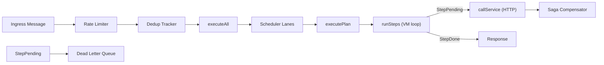
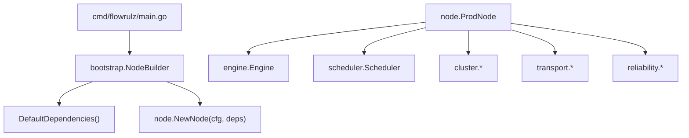

# Architecture

FlowRulZ follows a **hybrid leader-follower** model with Raft consensus for cluster coordination and a priority-scheduled DAG execution engine.

## High-Level Flow

## Key Architectural Decisions

| Decision | Choice | Rationale |
|----------|--------|-----------|
| Cluster coordination | [[Raft Consensus\|Raft]] | Well-understood, hashicorp/raft library |
| Plan execution | Rust VM via CGo | Performance, memory safety, WASM support |
| Scheduling | Priority lanes + [[Scheduler#Work Stealing\|work stealing]] | Fairness + utilization |
| Service calls | HTTP | Simple, universal, no additional infra |
| State persistence | JSON files on disk | Minimal dependencies, debuggable |
| Transport | Kafka or embedded gRPC bus | Pluggable, cluster-aware |
| DI | Manual constructor injection | Simple, no framework overhead |

## Layers

### Cluster Layer (`[[Cluster]]`)
- [[Raft Consensus]] for leader election and term tracking
- [[Membership]] gossip protocol for node discovery
- [[Partition]] Manager for key-space partitioning and rebalancing

### Execution Layer
- [[Engine]] compiles DSL → bytecode plans
- [[PlanDist]] distributes plans from leader to followers
- [[Scheduler]] queues and dispatches execution via work-stealing lanes
- [[Runtime]] VM executes DAG steps

### Reliability Layer (`[[Reliability]]`)
- [[Reliability#Dead Letter Queue\|DLQ]] for failed messages
- [[Reliability#Saga\|Saga]] for multi-step compensation
- [[Reliability#Circuit Breaker\|Circuit Breaker]] for service resilience
- [[Reliability#Dedup\|Dedup Tracker]] for idempotency
- [[Reliability#Rate Limiter\|Rate Limiter]] for ingress control

### Transport Layer (`[[Transport]]`)
- [[Transport#Kafka\|Kafka]] for production deployments
- [[Transport#gRPC Bus\|gRPC Bus]] for embedded cluster communication
- [[Transport#Cluster\|Cluster Transport]] for peer-to-peer messaging

### Observability
- [[Observability]] — OTel tracing, metrics collection, span export

## DI Architecture

See [[Bootstrap]] for the composition root details.
