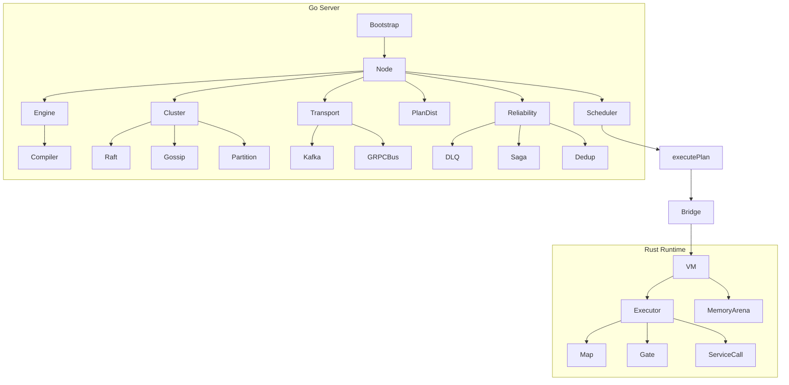

# FlowRulZ

> [!info] Event-driven DAG execution engine
> FlowRulZ is a distributed rule engine that compiles DSL rules into bytecode execution plans, distributes them across a Raft cluster, and executes them via a Rust-based VM with work-stealing scheduling.

## Codebase Overview

| Layer | Language | Path | Purpose |
|-------|----------|------|---------|
| [[Server]] | Go | `server/` | Cluster coordination, scheduling, transport, DI |
| [[Runtime]] | Rust | `runtime/` | Bytecode VM, DAG executor, memory arena |
| [[SDK]] | Go | `sdk/` | Client library for service integration |
| [[Simulator]] | Go | `simulator/` | Load generation and timeline testing |
| Bridge | CGo | `bridge/` | Go↔Rust FFI via `flowrulz_core` |

## Quick Links

- [[Architecture]] — system architecture overview
- [[Plan Execution]] — how plans flow through the system
- [[Raft Consensus]] — cluster coordination
- [[Message Flow]] — end-to-end message path
- [[FlowRULZ DSL]] — rule language syntax

> [!quote] Design principle
> "A plan is a DAG. The scheduler assigns lanes. The VM executes steps. Compensation undoes failures."

## Modules

See [[Architecture.canvas]] for the interactive visual map.
