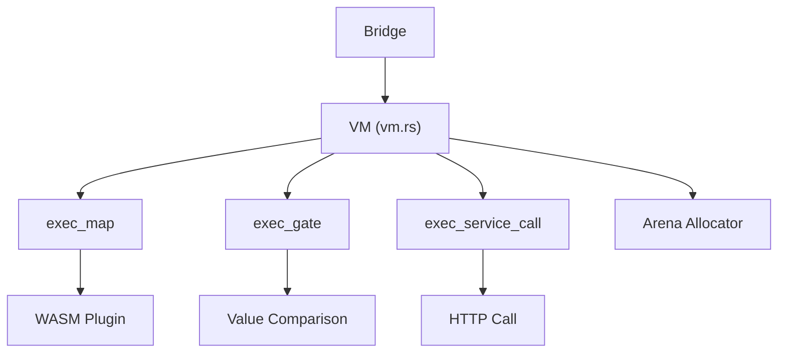

# Runtime

The Rust runtime (`runtime/`) is the execution engine. It compiles to a C dynamic library (`libflowrulz_core`) and is called via the [[Bridge]] CGo layer.

## Architecture

## Bytecode Format

| Field | Size | Description |
|-------|------|-------------|
| OpCode | 1 byte | MAP, GATE, SERVICE_CALL, etc. |
| Flags | 1 byte | Comparison operator for gates |
| A (u16) | 2 bytes | Constant pool index |
| B (u16) | 2 bytes | Second operand index |
| Unused | 2 bytes | Padding / alignment |

## Execution Steps

The VM executes a plan as a sequence of steps via `bridge.ExecuteStep`:

1. **Map** — transform input via JSON expression (constant pool lookup)
2. **Gate** — conditional branching via comparison operators
3. **Service Call** — invoke external HTTP service
4. **Next** — advance to next instruction
5. **JumpOffset** — skip N instructions (gate failure path)
6. **Label** — jump target marker
7. **Retry** — retry with backoff data
8. **TypeGuard** — type assertion on field values

## Memory

Plans use a [[MemoryArena]] (`bumpalo`-based) for zero-copy allocation during execution. Span tracing uses a lock-free ring buffer.

## Modules

- `runtime/src/executor/` — MAP, GATE, SERVICE_CALL, helpers
- `runtime/src/bytecode/` — instruction set, opcodes, plan, schema
- `runtime/src/memory/` — arena allocator
- `runtime/src/tracing/` — span ring buffer for performance tracing
- `runtime/src/ffi/` — C FFI exports for the Go bridge
