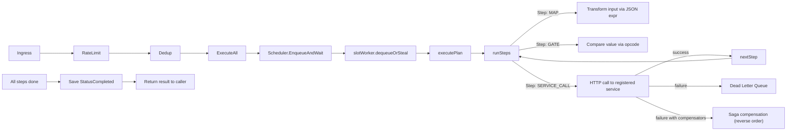

# Plan Execution

A plan is a DAG of steps. Execution proceeds through the [[Runtime]] VM, one step at a time.

## Lifecycle



## Priority Assignment

Plans are assigned a priority lane based on rule configuration:

| Lane | Priority | Workers | Use Case |
|------|----------|---------|----------|
| Fast | 0 (highest) | `NumCPU` | Low-latency rules, health checks |
| Normal | 1 | `2 × NumCPU` | Default for most rules |
| Heavy | 2 (lowest) | 3 | Batch processing, expensive computations |

## Work Stealing

See [[Scheduler#Work Stealing]] for details. When a lane is idle, workers steal from higher-priority lanes.

## Execution Record

After completion (success or failure), the [[ExecState]] `FileStore` saves the record:

```json
{
  "planID": "rule-123",
  "msgID": "msg-456",
  "status": "completed",
  "output": {"result": "ok"},
  "steps": [...],
  "startedAt": "...",
  "completedAt": "..."
}
```

For output persistence in the blockchain context, see [[FlowRULZ DSL#Output Persistence\|Output Persistence]].
