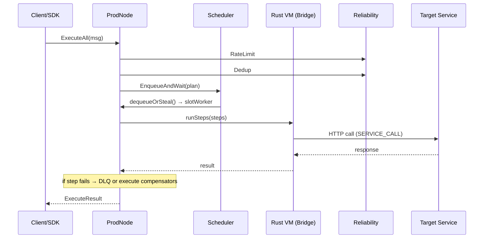

# Node

> [!info] Production node — the main struct
> Path: `server/internal/node/`

`ProdNode` is the central struct that wires together all server modules and implements the public `Node` interface. It is the refactored successor to the deleted `execnode/` package.

## Implements

```go
type Node interface {
    Start(ctx context.Context) error
    Stop(ctx context.Context) error
    ExecuteAll(ctx context.Context, msg *Message) (*ExecuteResult, error)
    Cluster() cluster.RaftNode
    Scheduler() scheduler.Scheduler
}
```

## ExecuteAll

> [!important] ExecuteAll refactored (Gap #3)
> `ExecuteAll` now routes through `Scheduler.EnqueueAndWait`. Incoming messages are: rate-limited → dedup'd → queued on a priority lane → dispatched to a slot worker → `executePlan()` → `Bridge(runSteps)` → Rust VM.

## Construction

Built exclusively through [[Bootstrap]]:

```go
deps := bootstrap.DefaultDependencies(config)
node := node.NewNode(config, deps)
```

## Dependencies

- [[Cluster]]
- [[Scheduler]]
- [[Transport]]
- [[Engine]]
- [[PlanDist]]
- [[Reliability]] (DLQ, Saga, Circuit Breaker, Dedup, Rate Limiter)
- [[ExecState]]
- [[Registry]]
- [[Membership]]
- [[Plugins]]
- [[Observability]]

## Key Flow


