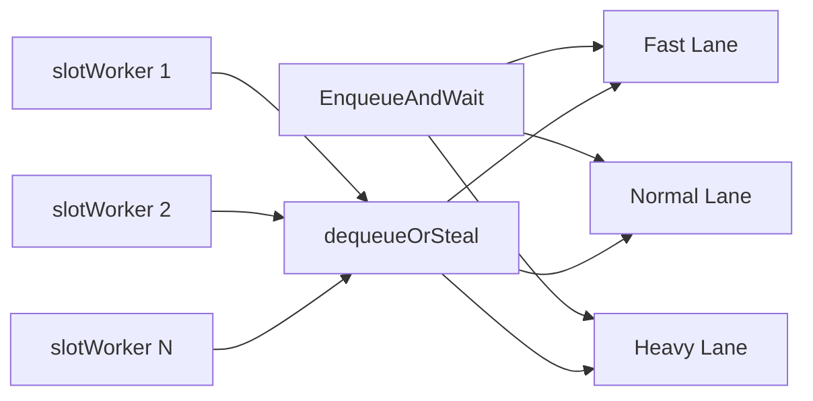

# Scheduler

> [!info] Priority lanes with work stealing
> Path: `server/internal/scheduler/`

Dispatches plan execution with three priority lanes (Fast, Normal, Heavy) and work stealing when a lane is idle.

## Architecture



## Key Types

| Type | File | Purpose |
|------|------|---------|
| `Scheduler` | `scheduler.go` | Main interface: `EnqueueAndWait`, `Enqueue`, `Start`, `Stop` |
| `schedulerImpl` | `scheduler.go` | Concrete impl with priority lanes |
| `slotWorker` | `slot_worker.go` | Goroutine per slot, calls `dequeueOrSteal()` |
| `PriorityLane` | `lane.go` | Channel-based queue with configurable priority |

## Work Stealing

> [!important] Work stealing (Gap #5)
> When a `slotWorker` finds its primary lane empty, it steals from Heavy → Normal → Fast in priority order. This prevents starvation while maximizing throughput.

- `dequeueOrSteal()` — try primary lane first, then steal from higher-priority lanes
- Lanes: Heavy (3 workers) → Normal (2× CPU) → Fast (1 per CPU)

## Scheduler Interface

```go
type Scheduler interface {
    EnqueueAndWait(ctx context.Context, plan *Plan) (*ExecuteResult, error)
    Enqueue(ctx context.Context, plan *Plan) (<-chan *ExecuteResult, error)
    Start(ctx context.Context) error
    Stop(ctx context.Context) error
}
```
